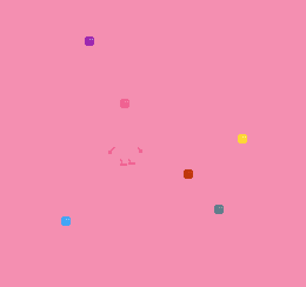

# Invisi-bean

Author: Michelle Chang

Design: Try to be invisible by changing the bean's color by moving to the corresponding color blocks!

Screen Shot:

How Your Asset Pipeline Works:
1. I imported the png files using the load_png function.
2. I set an index into the palette_table with a palette made of the colors that the png has. I basically loop through pixels on the png and look for new colors to add to the palette.
3. Using the obtained palette, I set the corresponding bit0 and bit1 vectors within a slot in the tile_table. Considering assets that are larger than 8x8, I would use multiple tiles for a single asset.

How To Play:
Use arrow keys to move the bean
Move to a color block to change the bean into the corresponding color
Amount of time spent invisible will be printed on the terminal window

Sources: 
I created the png's with [pixelart](www.pixilart.com).

This game was built with [NEST](NEST.md).

